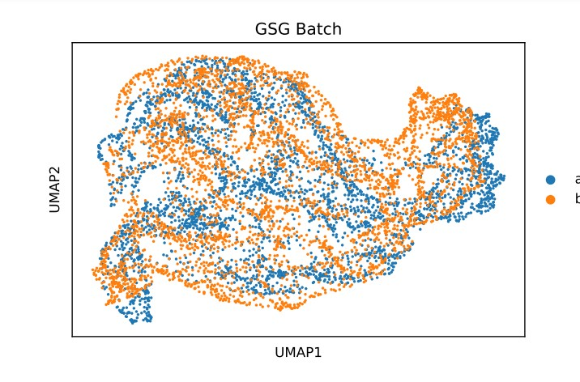
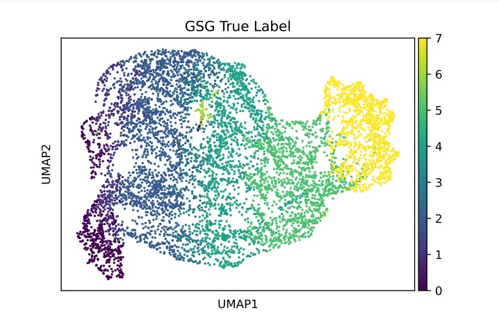

# Result output

This functions are used to show the umap results and save them. 

#### Examples

```
result_file = args.folder_name  +  args.before_sample_name + "_" + args.after_sample_name
GSG.mkdir(result_file)

# two data preprocessing and fusion
adatas = GSG.Data_read_and_comb(args)

# two data are mapped separately
two_graph,two_adata = GSG.Graph_Get_And_Data_Charge(adatas,args)

# use one data to train the model
model = GSG.GSG_batch_effect_train(args,two_graph)

# Two batches of data are fused and then clustered together. The clustering results are saved in.obs["Comb_K_means_Number"] and UMAP and space map are drawn
adatas_GSG = GSG.GSG_Cluster_Comb(two_adata,args,result_file)

```





