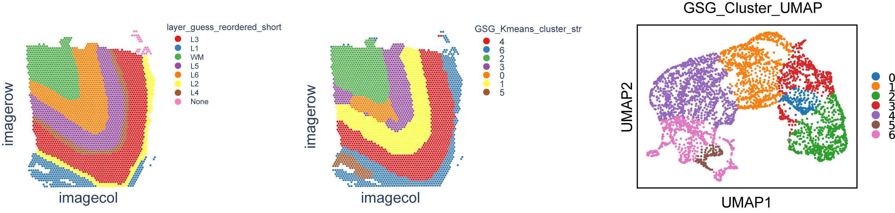

# Result output


### Examples
```
# UMAP
sc.pp.neighbors(adata, n_neighbors=10,use_rep='GSG_embedding')
sc.tl.umap(adata)
fig_new = sc.pl.umap(adata, color="GSG_Kmeans_cluster_str",title ="GSG_Cluster_UMAP",size = 50,return_fig=True)
fig_new.savefig(result_file + "/GSG_Cluster_UMAP.pdf",bbox_inches='tight',dpi =1000)

# draw spatial picture
adata = GSG.GSG_Spatial_Pic(adata,args,result_file)
#newadata = adata
print("hello java")
```


