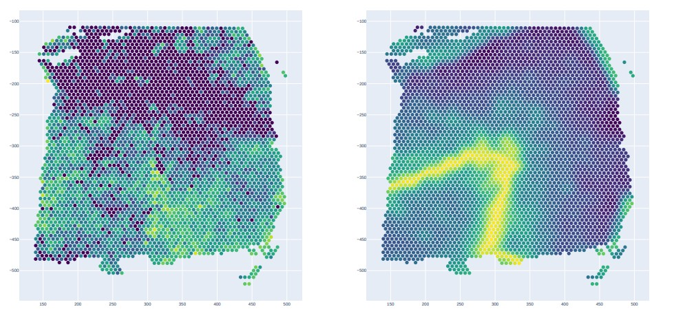

# Result output

This function is used to show the gene reconstruct results.
This function used the anndata object from the resultof the function GSG.GSG_Cluster_Comb,and the model from the process in training the model. 

#### Examples

```
# get merge of the gene
result_embedding =  model.decoder(graph.to(device),middle_embedding)
adata.obsm["scGraphMAE_gene"] = result_embedding.cpu().detach().numpy()
before_gene_csv_merge = pd.merge(before_gene_csv,cell_csv,left_index=True,right_index=True)
after_gene_csv_merge = pd.merge(after_gene_csv,cell_csv,left_index=True,right_index=True)

# draw picture
gene_name = "SCGB2A2"
drawPicture(before_gene_csv_merge,col_name ="imagecol",row_name = "imagerow",colorattribute = gene_name,save_file = None,is_show=True,is_save= False)
drawPicture(after_gene_csv_merge,col_name ="imagecol",row_name = "imagerow",colorattribute = gene_name,save_file = None,is_show=True,is_save= False)
```




